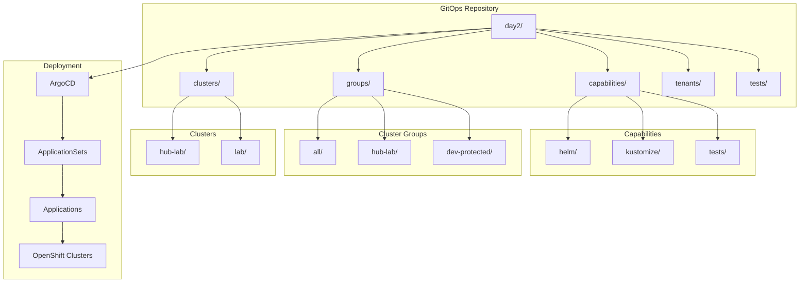

# Day2 Operations - GitOps Configuration Management

This directory contains the complete GitOps configuration management system for OpenShift clusters, providing automated deployment, configuration, and management of cluster capabilities through ArgoCD and Advanced Cluster Management (ACM).

## 📋 Table of Contents

- [Overview](#-overview)
- [Architecture](#-architecture)
- [Directory Structure](#-directory-structure)
- [Key Components](#-key-components)
- [Quick Start](#-quick-start)
- [Configuration Management](#️-configuration-management)
- [Deployment Strategies](#-deployment-strategies)
- [Testing and Validation](#-testing-and-validation)
- [Troubleshooting](#-troubleshooting)
- [Additional Documentation](#-additional-documentation)
- [Contributing](#-contributing)
- [License](#-license)

## 🎯 Overview

The Day2 Operations directory implements a comprehensive GitOps-based platform management system that provides:

- **Automated Cluster Management**: Deploy and configure OpenShift clusters using GitOps principles
- **Capability Management**: Reusable components and configurations for cluster capabilities
- **Multi-Environment Support**: Support for hub clusters, workload clusters, and tenant configurations
- **Policy-Driven Configuration**: ACM policies for consistent cluster configuration
- **Helm and Kustomize Integration**: Flexible deployment strategies using both tools
- **Comprehensive Testing**: Automated validation of all configurations

## 🏗️ Architecture



## 📁 Directory Structure

```
day2/
├── README.md                           # This file - Main documentation
├── capabilities/                       # Reusable capabilities and components
│   ├── helm/                          # Helm charts for capabilities
│   │   └── charts/
│   │       ├── application-set/       # ArgoCD ApplicationSet Helm chart
│   │       └── compute-gitops/        # Compute cluster GitOps chart
│   ├── kustomize/                     # Kustomize base configurations
│   │   └── bases/
│   │       ├── acm-hub/               # ACM hub configuration
│   │       ├── acm-policies-openshift-gitops/  # ACM policies
│   │       ├── cluster-gitops-repository-configuration/  # GitOps repo config
│   │       ├── external-secrets-configuration/  # External secrets
│   │       ├── external-secrets-operator/       # ESO operator
│   │       ├── groupsync-configuration/         # Group sync config
│   │       ├── identity-configuration/          # Identity provider config
│   │       ├── kubelet-configuration/           # Kubelet tuning
│   │       ├── node-maintenance-operator/       # Node maintenance
│   │       ├── oauth-configuration/             # OAuth config
│   │       ├── openshift-gitops/                # OpenShift GitOps
│   │       └── openshift-gitops-operator/       # GitOps operator
│   └── tests/                         # Capability validation tests
│       └── test-all-kustomization-builds-playbook.yaml
├── groups/                     # Logical cluster groupings
│   ├── README.md                      # Cluster groups documentation
│   ├── kustomize/                     # Kustomize group configurations
│   │   └── groups/
│   │       ├── all/                   # All clusters group
│   │       ├── dev-protected/         # Protected dev clusters
│   │       ├── hub-lab/               # Hub lab cluster group
│   │       ├── hub-lab-protected/     # Protected hub lab group
│   │       └── lab/                   # Lab cluster group
│   └── tests/                         # Group validation tests
├── clusters/                          # Individual cluster configurations
│   ├── hub-lab/                       # Hub lab cluster
│   │   ├── capabilities/              # Hub-specific capabilities
│   │   │   ├── acm-policies-openshift-gitops/  # ACM policies
│   │   │   ├── custom-cluster-name/   # Custom cluster naming
│   │   │   ├── managed-clusters/      # Managed cluster configs
│   │   │   └── web-console-cluster-customization/  # Console customization
│   │   ├── cluster-management-gitops/ # Cluster management GitOps
│   │   └── kustomization.yaml         # Hub lab kustomization
│   └── lab/                           # Lab workload cluster
│       ├── capabilities/              # Lab-specific capabilities
│       │   ├── tenant-gitops/         # Tenant GitOps configuration
│       │   └── web-console-cluster-customization/  # Console customization
│       ├── cluster-management-gitops/ # Cluster management GitOps
│       └── kustomization.yaml         # Lab cluster kustomization
├── tenants/                           # Multi-tenant configurations
│   ├── clusters/                      # Tenant cluster configs
│   │   ├── example-tenant/            # Example tenant configuration
│   │   └── lab/                       # Lab tenant configuration
│   └── tests/                         # Tenant validation tests
└── tests/                             # General validation tests
    └── test-all-kustomization-builds-playbook.yaml
```

## 🔧 Key Components

### 1. Capabilities (`capabilities/`)

Reusable components that can be deployed across multiple clusters:

- **Helm Charts**: Packaged applications and configurations
  - `application-set`: ArgoCD ApplicationSet management
  - `compute-gitops`: Compute cluster GitOps configuration

- **Kustomize Bases**: Base configurations for common capabilities
  - ACM (Advanced Cluster Management) configurations
  - External Secrets Operator
  - Identity and OAuth configuration
  - Kubelet tuning and node maintenance
  - OpenShift GitOps operator

### 2. Cluster Groups (`groups/`)

Logical groupings of clusters with shared capabilities:

- **`all`**: Capabilities applied to all clusters
- **`hub-lab`**: Hub cluster specific capabilities
- **`hub-lab-protected`**: Protected hub capabilities (cascade delete protection)
- **`dev-protected`**: Protected development cluster capabilities
- **`lab`**: Lab cluster specific capabilities

### 3. Clusters (`clusters/`)

Individual cluster configurations:

- **`hub-lab`**: Hub cluster for managing other clusters
- **`lab`**: Workload cluster for applications and services

### 4. Tenants (`tenants/`)

Multi-tenant configurations for isolated workloads:

- Tenant-specific cluster configurations
- Resource isolation and management
- Custom tenant capabilities

## 🚀 Quick Start

### Prerequisites

- OpenShift cluster with ArgoCD installed
- `kustomize` and `helm` CLI tools
- Access to the GitOps repository

### 1. Deploy Hub Cluster Configuration

```bash
# Deploy hub lab cluster configuration
kustomize build clusters/hub-lab/ | oc apply -f -

# Verify deployment
oc get applications -n openshift-gitops
```

### 2. Deploy Workload Cluster Configuration

```bash
# Deploy lab cluster configuration
kustomize build clusters/lab/ | oc apply -f -

# Verify deployment
oc get applications -n openshift-gitops
```

### 3. Validate All Configurations

```bash
# Run comprehensive validation tests
ansible-playbook tests/test-all-kustomization-builds-playbook.yaml
```

## ⚙️ Configuration Management

### Using Kustomize

All configurations use Kustomize for flexible, environment-specific customization:

```yaml
# Example: clusters/lab/kustomization.yaml
apiVersion: kustomize.config.k8s.io/v1beta1
kind: Kustomization

labels:
- includeSelectors: false
  pairs:
    app.kubernetes.io/part-of: platform-management

resources:
- cluster-management-gitops
```

### Using Helm Charts

Helm charts provide packaged applications with configurable values:

```yaml
# Example: capabilities/helm/charts/application-set/values.yaml
applicationSetDefaults:
  componentLabel: "platform-management"
  partOfLabel: "platform-management"
  argoCDProject: "platform-management"
  syncPolicyAutomated: true
```

### Environment-Specific Configuration

- **Development**: Use `dev-protected` group for development clusters
- **Production**: Use `hub-lab-protected` for production hub clusters
- **Testing**: Use `lab` group for testing and validation

## 🚀 Deployment Strategies

### 1. ApplicationSet-Based Deployment

Uses ArgoCD ApplicationSets for automated cluster discovery and configuration:

```yaml
# ApplicationSet automatically discovers clusters and deploys configurations
apiVersion: argoproj.io/v1alpha1
kind: ApplicationSet
metadata:
  name: cluster-management-gitops
spec:
  generators:
  - clusters:
      selector:
        matchLabels:
          cluster-type: "workload"
```

### 2. Policy-Driven Configuration

Uses ACM policies for consistent cluster configuration:

```yaml
# ACM policy ensures consistent configuration across clusters
apiVersion: policy.open-cluster-management.io/v1
kind: Policy
metadata:
  name: gitops-repository-configuration
spec:
  remediationAction: enforce
  policy-templates:
  - objectDefinition:
      apiVersion: policy.open-cluster-management.io/v1
      kind: ConfigurationPolicy
```

### 3. Multi-Environment Support

- **Hub Clusters**: Manage multiple workload clusters
- **Workload Clusters**: Run applications and services
- **Tenant Clusters**: Isolated environments for specific tenants

## 🧪 Testing and Validation

### Automated Testing

The system includes comprehensive testing capabilities:

```bash
# Test all Kustomize builds
ansible-playbook tests/test-all-kustomization-builds-playbook.yaml

# Test specific capability
kustomize build capabilities/kustomize/bases/openshift-gitops/

# Test cluster configuration
kustomize build clusters/lab/
```

### Validation Checks

- **Kustomize Build Validation**: Ensures all configurations build successfully
- **Helm Chart Validation**: Validates Helm chart templates and values
- **Resource Validation**: Checks for proper resource definitions
- **Dependency Validation**: Ensures all dependencies are satisfied

## 🔍 Troubleshooting

### Common Issues

1. **Kustomize Build Failures**
   ```bash
   # Check for missing resources
   kustomize build --enable-helm clusters/lab/
   
   # Verify base configurations
   kustomize build capabilities/kustomize/bases/openshift-gitops/
   ```

2. **ArgoCD Sync Issues**
   ```bash
   # Check application status
   oc get applications -n openshift-gitops
   
   # Check sync status
   oc describe application cluster-management-gitops -n openshift-gitops
   ```

3. **ACM Policy Issues**
   ```bash
   # Check policy compliance
   oc get policies -A
   
   # Check policy violations
   oc describe policy gitops-repository-configuration
   ```

### Debug Mode

Enable debug mode for detailed logging:

```bash
# Enable Kustomize debug
kustomize build --enable-helm --enable-alpha-plugins clusters/lab/

# Enable ArgoCD debug
oc patch application cluster-management-gitops -n openshift-gitops --type merge -p '{"spec":{"syncPolicy":{"syncOptions":["CreateNamespace=true"]}}}'
```

## 📚 Additional Documentation

- [Capabilities Documentation](capabilities/README.md)
- [Cluster Groups Documentation](groups/README.md)
- [Clusters Documentation](clusters/README.md)
- [Tenants Documentation](tenants/README.md)
- [Testing Documentation](tests/README.md)

## 🤝 Contributing

1. **Adding New Capabilities**: Create new base configurations in `capabilities/kustomize/bases/`
2. **Adding New Clusters**: Create cluster-specific configurations in `clusters/`
3. **Adding New Groups**: Create group configurations in `groups/kustomize/groups/`
4. **Testing Changes**: Run validation tests before committing changes

### Development Workflow

1. Create feature branch
2. Make configuration changes
3. Run validation tests
4. Test in development environment
5. Create pull request
6. Merge after review

## 📄 License

This project is part of the ODFL OpenShift vSphere IPI Installation automation framework.

---

**Note**: This GitOps configuration system is designed for production use and includes comprehensive testing, validation, and troubleshooting capabilities. Always test changes in a development environment before deploying to production.